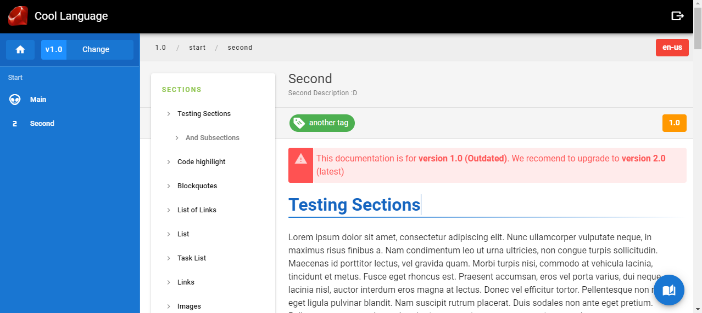
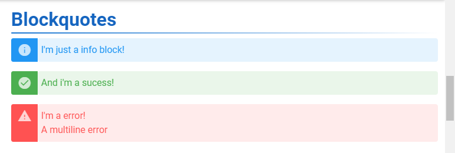
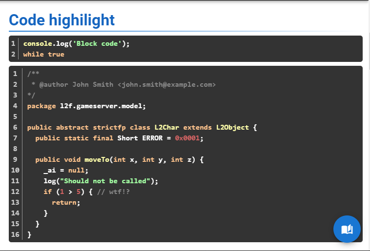
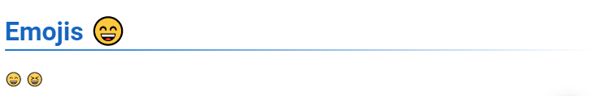

# Wiki Gen Lib
### Generate wiki static website from markdown files
### Based on Wiki.js (https://wiki.js.org/)
## Features
- Multi Language Support
- Multi Version Support
- Nice Design (Made using Vuetify)
- Responsive (Mobile Friendly)
- Automatic syntax highlighting (Using highlight.js)
- Automatic code line count (Using highlightjs-line-numbers)
- Jquery Integrated
- Vue.js Integrated

## How to use
### 1 - Clone repository to a folder
### 2 - Open terminal
### 3 - Run 'node wikigen.js'
(The .html will be generated in folder 'output'. You can copy the folder content and move to anywhere)

## Customization
### 1 - To edit the html structure, edit 'internal/template.html' file
### 2 - To edit messages and content, edit 'content/language' files
### 3 - To add a language, edit 'languages.json'
### 4 - To add pages and tags, or change return path, edit 'structure.json'

## Screenshots

